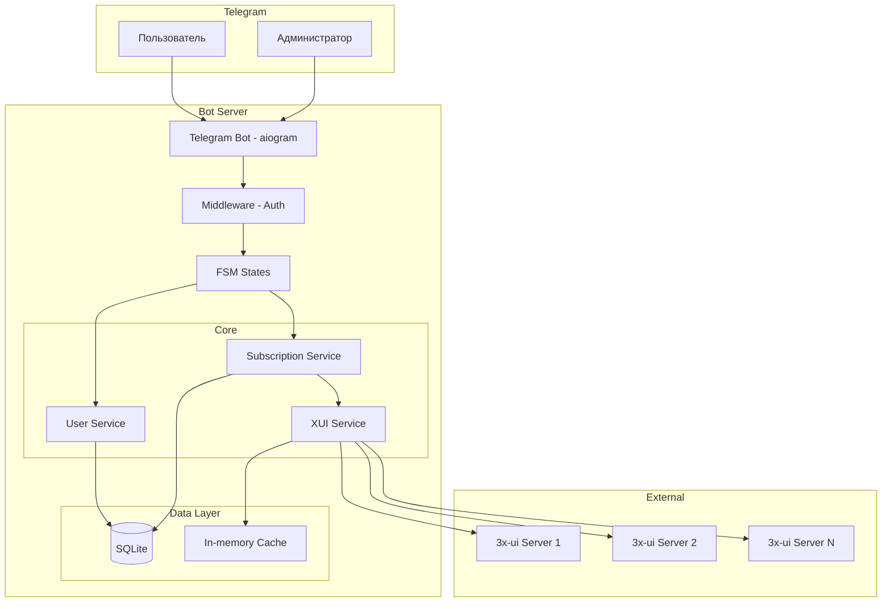
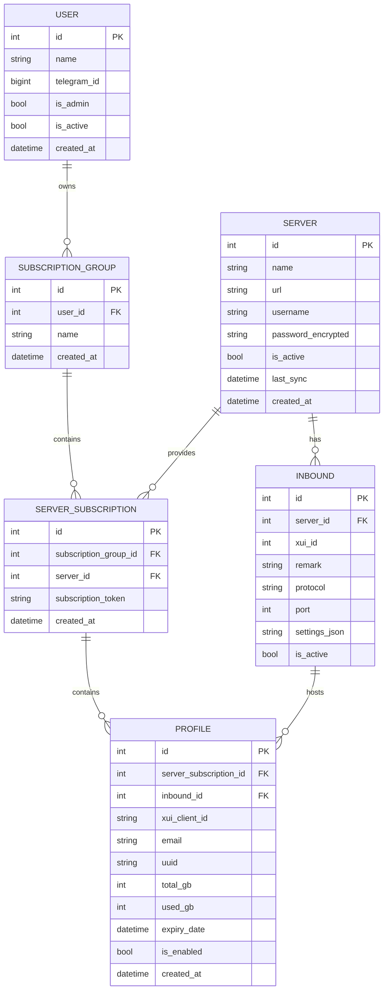
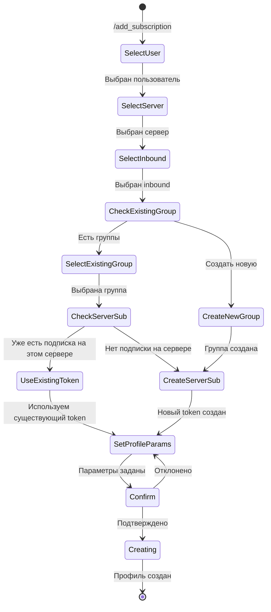
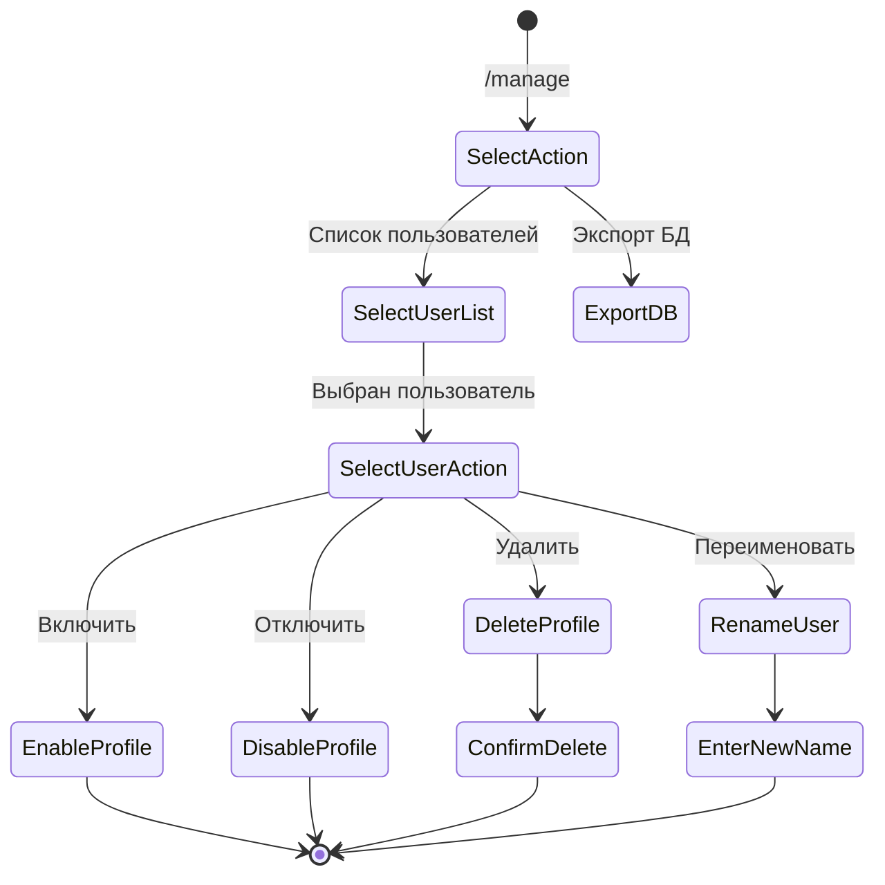
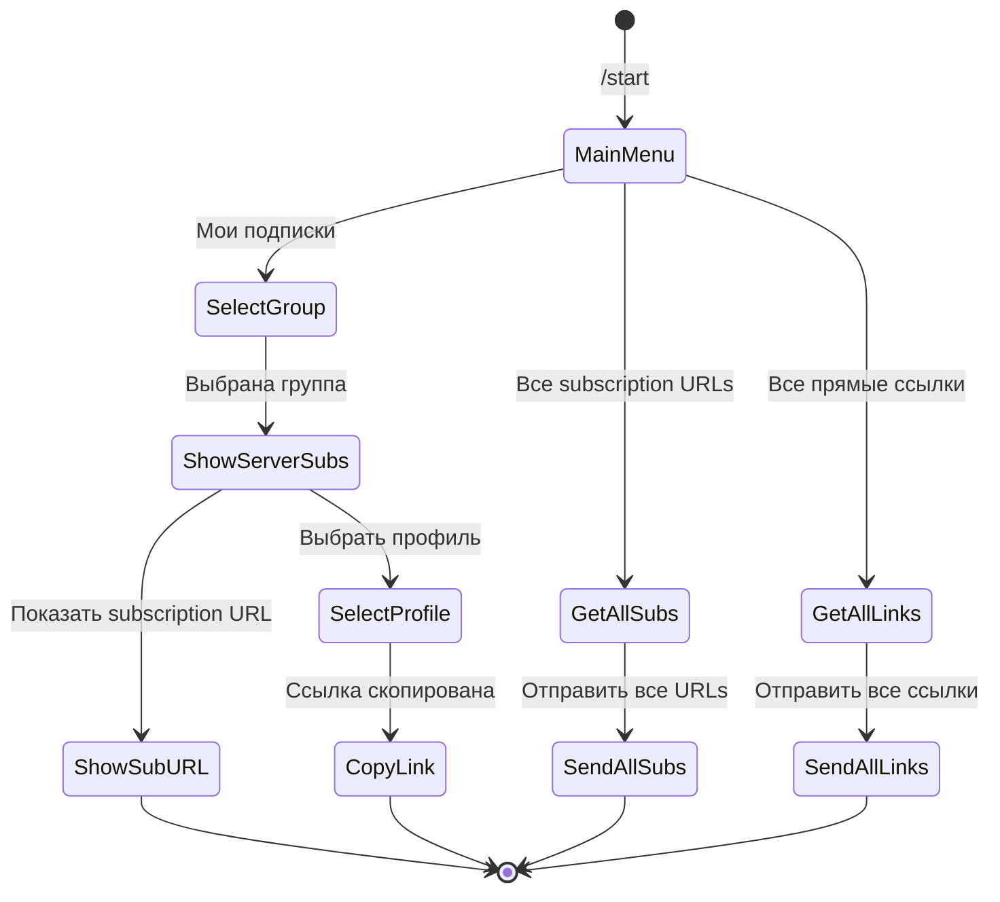

# VPN Manager - Архитектура приложения

## Обзор проекта

Телеграм-бот для управления VPN подписками через несколько панелей 3x-ui на разных серверах.

**Целевой масштаб**: 2-3 сервера, <100 пользователей, легковесная архитектура.

---

## Технологический стек

| Компонент | Технология | Обоснование |
|-----------|------------|-------------|
| Язык | Python 3.11+ | Низкий порог входа, богатая экосистема |
| Telegram Bot | aiogram 3.x | Асинхронный, современный, эффективный |
| База данных | SQLite + aiosqlite | Легковесный, не требует отдельного сервера |
| ORM | SQLAlchemy 2.0 | Асинхронная поддержка, типизация |
| HTTP клиент | aiohttp | Для API 3x-ui панелей |
| Конфигурация | pydantic-settings | Валидация, env переменные |
| Логирование | loguru | Простота и информативность |

---

## Архитектура системы



---

## Структура папок и файлов

```
vpn-manager/
├── app/
│   ├── __init__.py
│   ├── main.py                    # Точка входа
│   │
│   ├── config.py                  # Конфигурация (pydantic-settings)
│   │
│   ├── bot/
│   │   ├── __init__.py
│   │   ├── router.py              # Главный роутер
│   │   ├── middlewares/
│   │   │   ├── __init__.py
│   │   │   └── auth.py            # Auth middleware
│   │   ├── filters/
│   │   │   ├── __init__.py
│   │   │   └── admin.py           # Фильтр админа
│   │   ├── handlers/
│   │   │   ├── __init__.py
│   │   │   ├── common.py          # /start, /help, отмена
│   │   │   ├── admin/
│   │   │   │   ├── __init__.py
│   │   │   │   ├── servers.py     # Управление серверами
│   │   │   │   ├── users.py       # Управление пользователями
│   │   │   │   └── subscriptions.py # Управление подписками
│   │   │   └── user/
│   │   │       ├── __init__.py
│   │   │       └── subscriptions.py # Просмотр своих подписок
│   │   ├── keyboards/
│   │   │   ├── __init__.py
│   │   │   ├── inline.py          # Inline кнопки
│   │   │   └── reply.py           # Reply кнопки
│   │   └── states/
│   │       ├── __init__.py
│   │       ├── admin.py           # FSM states для админа
│   │       └── user.py            # FSM states для пользователя
│   │
│   ├── database/
│   │   ├── __init__.py
│   │   ├── connection.py          # Async engine, session
│   │   ├── models/
│   │   │   ├── __init__.py
│   │   │   ├── base.py            # Base класс
│   │   │   ├── server.py          # Модель Server
│   │   │   ├── inbound.py         # Модель Inbound
│   │   │   ├── user.py            # Модель User
│   │   │   ├── subscription_group.py # Модель SubscriptionGroup
│   │   │   ├── server_subscription.py # Модель ServerSubscription
│   │   │   └── profile.py         # Модель Profile
│   │   └── repositories/
│   │       ├── __init__.py
│   │       ├── base.py            # Базовый репозиторий
│   │       ├── server.py
│   │       ├── user.py
│   │       ├── subscription_group.py
│   │       ├── server_subscription.py
│   │       └── profile.py
│   │
│   ├── services/
│   │   ├── __init__.py
│   │   ├── user_service.py        # Бизнес-логика пользователей
│   │   ├── subscription_service.py # Бизнес-логика подписок
│   │   └── xui_service.py         # API клиент 3x-ui
│   │
│   ├── xui_client/
│   │   ├── __init__.py
│   │   ├── client.py              # HTTP клиент для 3x-ui
│   │   ├── models.py              # Pydantic модели для API
│   │   └── exceptions.py          # Исключения API
│   │
│   └── utils/
│       ├── __init__.py
│       ├── uuid_generator.py      # Генерация UUID
│       ├── subscription_url.py    # Формирование URL подписок
│       └── helpers.py             # Вспомогательные функции
│
├── data/
│   └── vpn_manager.db             # SQLite база данных
│
├── logs/
│   └── app.log
│
├── .env.example                   # Пример конфигурации
├── .env                           # Конфигурация (не в git)
├── requirements.txt
├── pyproject.toml
└── README.md
```

---

## Модели данных

### Ключевая концепция подписок

```
User (Реальный человек)
  └── SubscriptionGroup (Группа подписок, например "Основная", "Рабочая")
        └── ServerSubscription (Связь группы + сервера = один subscription_token)
              └── Profile (Конкретный профиль на конкретном inbound)
```

**Важно**: Subscription token привязан к паре (SubscriptionGroup + Server).
- Один сервер в рамках одной группы = один subscription token
- Разные серверы в одной группе = разные subscription tokens
- Новый профиль на том же сервере в той же группе = тот же subscription token

### ER-диаграмма



### Описание моделей

#### Server
Хранит информацию о 3x-ui панелях.

| Поле | Тип | Описание |
|------|-----|----------|
| id | int | Primary key |
| name | str | Человекочитаемое имя (например, "NL-Server-1") |
| url | str | URL панели (https://panel.example.com) |
| username | str | Логин для API |
| password_encrypted | str | Зашифрованный пароль |
| is_active | bool | Активен ли сервер |
| last_sync | datetime | Последняя синхронизация inbounds |
| created_at | datetime | Дата создания |

#### Inbound
Кэшированная информация о inbounds с серверов.

| Поле | Тип | Описание |
|------|-----|----------|
| id | int | Primary key |
| server_id | int | FK к Server |
| xui_id | int | ID inbound в 3x-ui |
| remark | str | Название inbound |
| protocol | str | VLESS, VMess, и т.д. |
| port | int | Порт |
| settings_json | str | JSON с настройками |
| is_active | bool | Активен ли inbound |

#### User
Реальные люди, которые используют VPN.

| Поле | Тип | Описание |
|------|-----|----------|
| id | int | Primary key |
| name | str | Имя пользователя |
| telegram_id | bigint | Telegram ID (nullable - не обязателен) |
| is_admin | bool | Является ли админом |
| is_active | bool | Активен ли |
| created_at | datetime | Дата создания |

#### SubscriptionGroup
Группа подписок пользователя. Логическая группировка профилей.

| Поле | Тип | Описание |
|------|-----|----------|
| id | int | Primary key |
| user_id | int | FK к User |
| name | str | Название группы (например, "Основная", "Рабочая") |
| created_at | datetime | Дата создания |

#### ServerSubscription
Связь между группой подписок и сервером. Содержит subscription token.

| Поле | Тип | Описание |
|------|-----|----------|
| id | int | Primary key |
| subscription_group_id | int | FK к SubscriptionGroup |
| server_id | int | FK к Server |
| subscription_token | str | Уникальный токен для URL подписки на этом сервере |
| created_at | datetime | Дата создания |

**Уникальность**: (subscription_group_id, server_id) - одна группа + один сервер = один token

#### Profile
Конкретный профиль на конкретном inbound.

| Поле | Тип | Описание |
|------|-----|----------|
| id | int | Primary key |
| server_subscription_id | int | FK к ServerSubscription |
| inbound_id | int | FK к Inbound |
| xui_client_id | str | ID клиента в 3x-ui (email или UUID) |
| email | str | Email в 3x-ui |
| uuid | str | UUID клиента |
| total_gb | int | Лимит трафика (0 = безлимит) |
| used_gb | int | Использовано |
| expiry_date | datetime | Дата истечения |
| is_enabled | bool | Включен ли |
| created_at | datetime | Дата создания |

---

## Пример данных

```
User: Иван (telegram_id: 123456)
  │
  ├── SubscriptionGroup: "Основная"
  │     │
  │     ├── ServerSubscription: (Server: NL-1, token: abc123)
  │     │     ├── Profile: VLESS @ inbound:1 (email: ivan_main_nl1)
  │     │     └── Profile: VLESS @ inbound:2 (email: ivan_main_nl1_stream)
  │     │
  │     └── ServerSubscription: (Server: DE-1, token: def456)
  │           └── Profile: VLESS @ inbound:1 (email: ivan_main_de1)
  │
  └── SubscriptionGroup: "Рабочая"
        │
        └── ServerSubscription: (Server: NL-1, token: xyz789)
              └── Profile: VLESS @ inbound:1 (email: ivan_work_nl1)
```

**Subscription URLs для Ивана:**
- Основная + NL-1: `https://nl1.example.com/sub/abc123`
- Основная + DE-1: `https://de1.example.com/sub/def456`
- Рабочая + NL-1: `https://nl1.example.com/sub/xyz789`

---

## API клиент 3x-ui

### Основные endpoints

```python
class XUIClient:
    # Аутентификация
    POST /login                    # Вход, получение session cookie
    POST /logout                   # Выход
    
    # Inbounds
    GET /panel/api/inbounds/list   # Список всех inbounds
    GET /panel/api/inbounds/get/{id} # Получить inbound
    
    # Clients
    POST /panel/api/inbounds/addClient/{id}    # Добавить клиента
    POST /panel/api/inbounds/updateClient/{id} # Обновить клиента
    POST /panel/api/inbounds/{id}/delClient/{clientId} # Удалить клиента
    GET /panel/api/inbounds/list/{id}          # Клиенты inbound
```

### Модель клиента для VLESS

```python
class XUIClientModel(BaseModel):
    id: str           # UUID
    email: str        # Уникальный email
    enable: bool
    flow: str         # xtls-rprx-vision для VLESS
    totalGB: int      # Лимит в байтах (0 = безлимит)
    expiryTime: int   # Unix timestamp в миллисекундах
    subId: str        # Subscription ID для генерации ссылок
```

---

## FSM (Finite State Machine) для диалогов

### Admin: Создание подписки



### Admin: Управление клиентами



### User: Получение ссылок



---

## Формирование ссылок

### Subscription URL (рекомендуется для пользователей)

Формат: `https://{server_host}/sub/{subscription_token}`

3x-ui генерирует контент автоматически на основе `subId` клиента.

**Пример ответа 3x-ui:**
```
vless://uuid@host:port?params#Profile1
vless://uuid@host:port2?params#Profile2
```

### Прямые ссылки VLESS

```
vless://{uuid}@{server_host}:{port}?security={security}&type={type}&flow={flow}#{remark}
```

Пример:
```
vless://abc123...@vpn.example.com:443?security=reality&type=tcp&flow=xtls-rprx-vision#NL-Server-1-Profile1
```

---

## Интерфейс для копирования ссылок

### Вариант 1: Subscription URL (основной)

```
📋 Ваши подписки

📁 Группа: Основная
├─ 🌐 NL-Server-1
│  └─ 🔗 https://nl1.example.com/sub/abc123
└─ 🌐 DE-Server-1
   └─ 🔗 https://de1.example.com/sub/def456

📁 Группа: Рабочая
└─ 🌐 NL-Server-1
   └─ 🔗 https://nl1.example.com/sub/xyz789

[📋 Скопировать всё] [📄 Как файл]
```

### Вариант 2: Inline кнопки с копированием

```
📋 Меню подписок

[📋 Все subscription URLs]
[🔗 Все прямые ссылки]
[📄 Скачать как файл]

[📁 Выбрать группу ▼]
```

При нажатии на кнопку - сообщение с кнопкой "📋 Скопировать":
```
📋 Subscription URLs:

https://nl1.example.com/sub/abc123
https://de1.example.com/sub/def456
https://nl1.example.com/sub/xyz789

[📋 Скопировать]
```

---

## Безопасность

1. **Шифрование паролей** - пароли от 3x-ui панелей хранятся зашифрованными (Fernet)
2. **Telegram ID** - проверка в middleware
3. **Admin фильтр** - только админы могут управлять подписками
4. **Логирование действий** - все изменения логируются

---

## Конфигурация (.env)

```env
# Telegram
BOT_TOKEN=your_bot_token

# Admin
ADMIN_TELEGRAM_IDS=123456789,987654321

# Database
DATABASE_URL=sqlite+aiosqlite:///./data/vpn_manager.db

# Encryption key for passwords (generate with: python -c "from cryptography.fernet import Fernet; print(Fernet.generate_key().decode())")
ENCRYPTION_KEY=your_fernet_key

# Logging
LOG_LEVEL=INFO
```

---

## Зависимости (requirements.txt)

```
# Telegram Bot
aiogram>=3.4.0

# Database
aiosqlite>=0.19.0
sqlalchemy>=2.0.0

# HTTP Client
aiohttp>=3.9.0

# Configuration
pydantic-settings>=2.1.0

# Security
cryptography>=41.0.0

# Logging
loguru>=0.7.0
```

---

## Следующие шаги

1. [ ] Инициализация проекта (pyproject.toml, requirements.txt)
2. [ ] Создание структуры папок
3. [ ] Реализация моделей базы данных
4. [ ] Реализация XUI клиента
5. [ ] Реализация сервисов
6. [ ] Реализация handlers бота
7. [ ] Тестирование
